# Supervised Machine Learning-Predicting Credit Risk:

In this assignment we  will be comparing the Logistic Regression model and Random Forest Classifier on the data provided by a lending services company that allows individual investors to partially fund personal loans as well as buy and sell notes backing the loans on a secondary market. Following are the steps performed on the data:

## Exploratory Data Analysis (EDA):

1. Dataset is inspected and unrelated columns are dropped.

2. Count of rows and columns are determined.

3. Unique values of categorical columns are identified.

4. Null rows and columns are dropped.

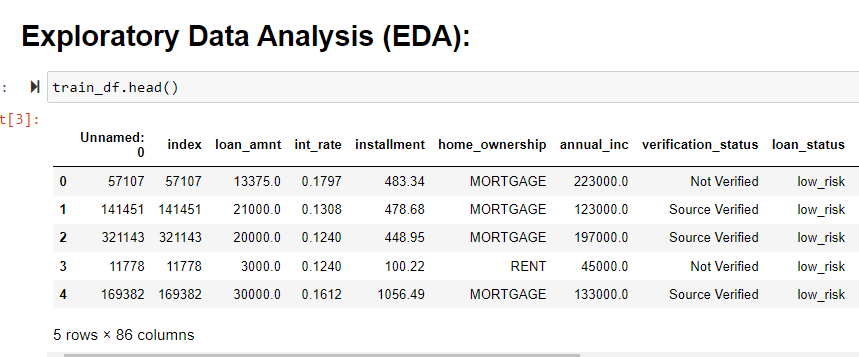

## Preprocessing Data:

1. Convert 2019loans.csv and 2020Q1loans.csv into pandas dataframe.

2. Convert the target columns in both datasets into  0 and 1, using LabelEncoder() function.

3. Features are selected from both dataframes and assigned to X_train and  X_test.

4. Categorical data is converted to numeric using one_hot encoding of the dataframe in both the dataframe.

5. Same number of columns are checked in train and test dataframes.

6. The dataframes are converted into scaler data using StandardScaler() function.

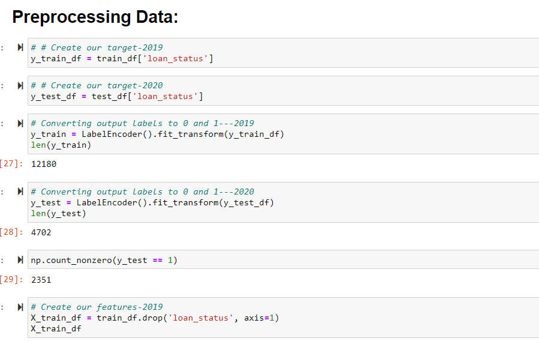

## Prediction for Better Model Performance:

1. Here we are dealing with the categorical data. My prediction is that random forests classifier model will perform better on this data. The parameters like n_estimator, can be adjusted to decide the number of loops for the decision tree, which in turns improve the performance of the model.

2. Instead of a single, complex tree, a random forests algorithm will sample the data and build several smaller, simpler decision trees, from a subset of the data. Each tree (weak classifier), when combined and aggregated, form a strong classifier. When doing this over and over again, we get a good estimater. This model also doesn't use all the features everytime.This thorough process prevent the problem of over fitting of data. When number of iterations increases, the model becomes more stable and good to fit.

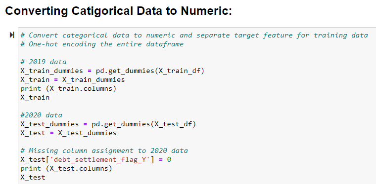

## Prediction for accuracy of the models by Scaling the data:

The data always need to be processed before it can be used in a machine learning algorithm. One of the preprocessing step is 'Scaling'. Since machine learning algorithms are sensitive to large data values, features need to be scaled to standerized ranges. The StandardScaler() function is used when we do not have complete knowledge of datasets. It scales the data to have mean of 0 and variance of 1. Also, Scaling/normalization is applied when more accuracy in prediction is expected. For this reason my prediction is that the score accuracy will improve by scaling/normalization.

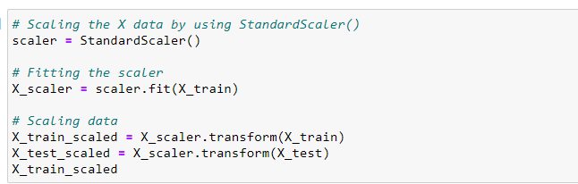

## Logistic Regression Model Testing on Unscaler Data:

Since the data is categorical, the logistic regression model is applied for testing the data.

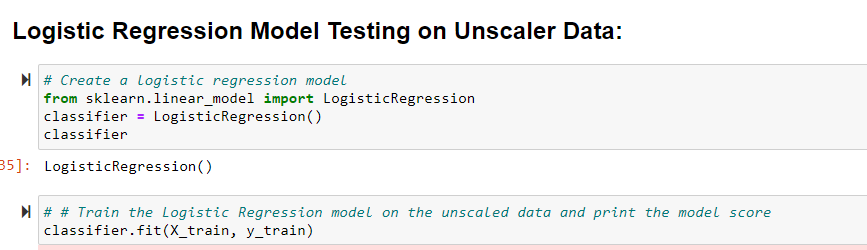

Confusion matrix, tells how good our model is in making true predictions about 0's and 1's outcome. 
Accuracy is the percentage of correct predictions. 
Accuracy = tp+tn/(tp+tn+fp+fn)
Sensitivity is how often our model correctly identify a positive value. 
Sensitivity/Recall = tp/(tp+fn)
Precision is the percentage of positive predictions that are correct. Precision = tp/(tp+fp) 

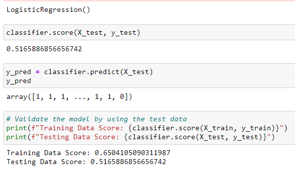

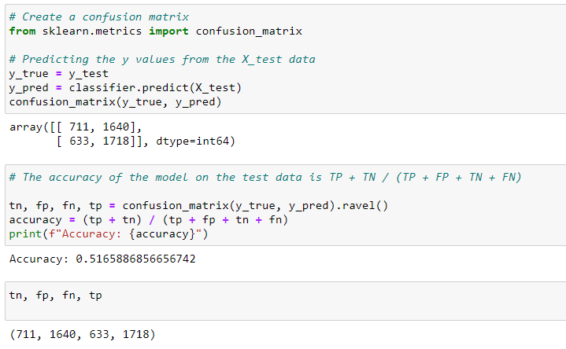

## Logistic Regression Model Testing on Scaler Data:

Logistic regression is applied on the scaler data.

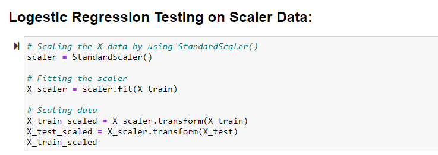

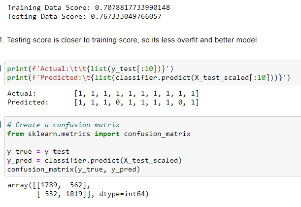

## Analysis Report:

1. The accuracy score (overall correct) for the logistic classifier model got improved from 0.560 to 0.7673 with the scaled data
2. The predicted values of 'tp' and 'tn' got improved.
3. And false negative and false positive numbers got reduced.
4. Testing score is closer to training score, so it's less overfit and better model.

## Random Forest Classifier Model Testing on Unscaler Data:

Random foreast classifier is applied on the data for achieving better accuracy.

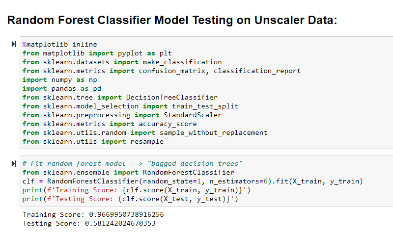

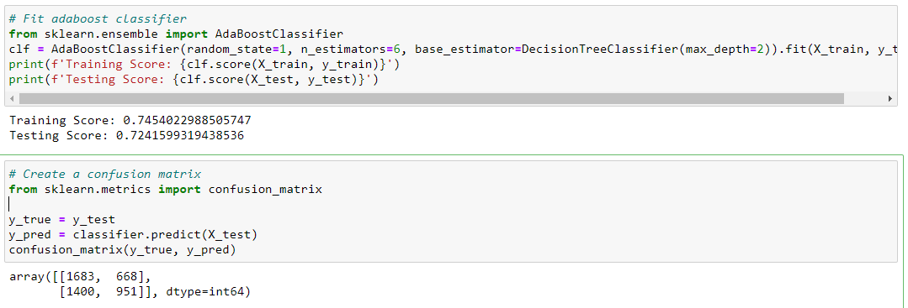

Accuracy = 0.560187154402382

1. The random forest classifier model performed better after 'addaboost' application on unscaler data.
2. The training and testing score got improved after 'addoboost' on unscaler data.
3. The overall correct accuracy is still low.

## Random Forest Classifier Model Testing on Scaler Data:

Random foreast classifier is applied on the data for achieving better accuracy.

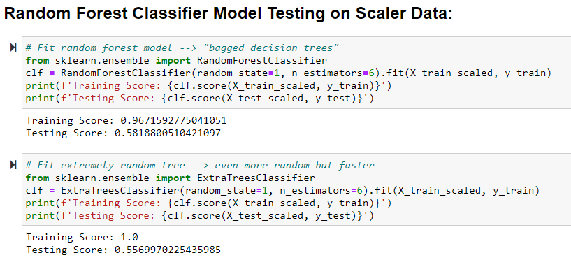

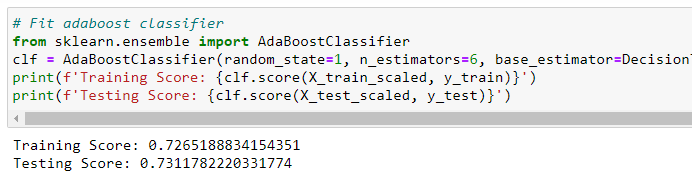

Accuracy: 0.6548277328796257

1. The random forest classifier model performed better after 'addaboost' application on scaler data.
2. The training and testing score got improved after 'addoboost' on scaler data.
3. The overall correct prediction accuracy is better, when the test is performed on scaled data. 

## Analysis Report:

1. After fitting both models, the logistic model performed better with the scaler data and confusion matrix distribution also got better than the Random forest model performance on a regular fit.

2. In both the LogisticRegression and Random Forest Classifiers, the models perform better with the scaler data. 

## Feature Selection is Performed:

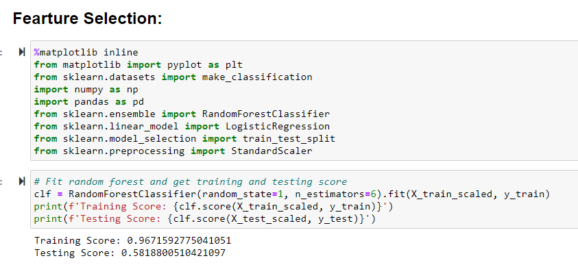

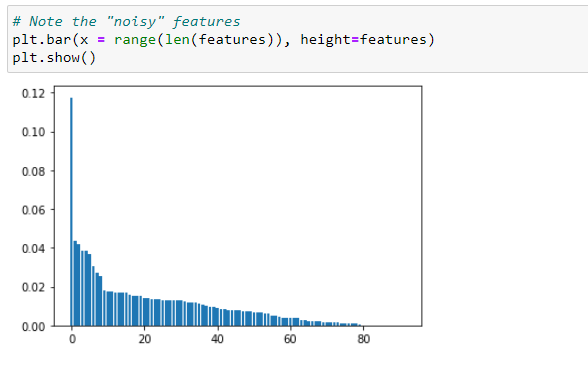

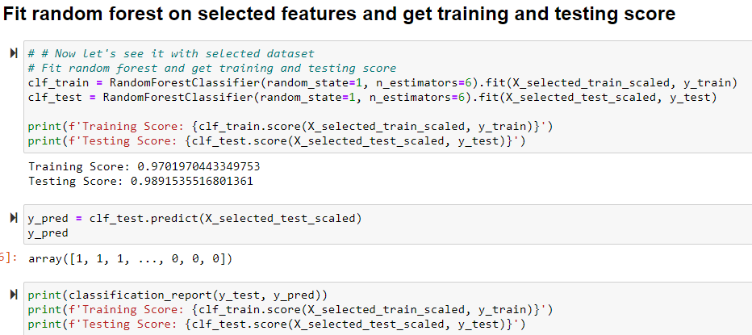

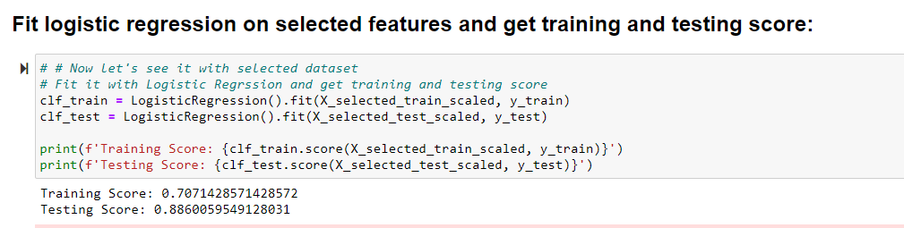

## Final Analysis Report:

1. After the feature selection process, Randon forest model accruracy got improved to 0.989153 with the scaler_selected features.

2. The confusion matrix got improved distribution of tp = 2312, tn = 2339, fp =12, fn = 39

3. The random forest model, when fit to the dataset is overfitting and showing a big difference between the training and testing data. That shows that the noisy parameters confuse it.

4. However, fitting to the smaller dataset with the selected features has less noisy parameters to confuse the model. So, we get a more accurate model.

5. After the feature selection process, random forest model performed the best with the selected features on scaled data.

